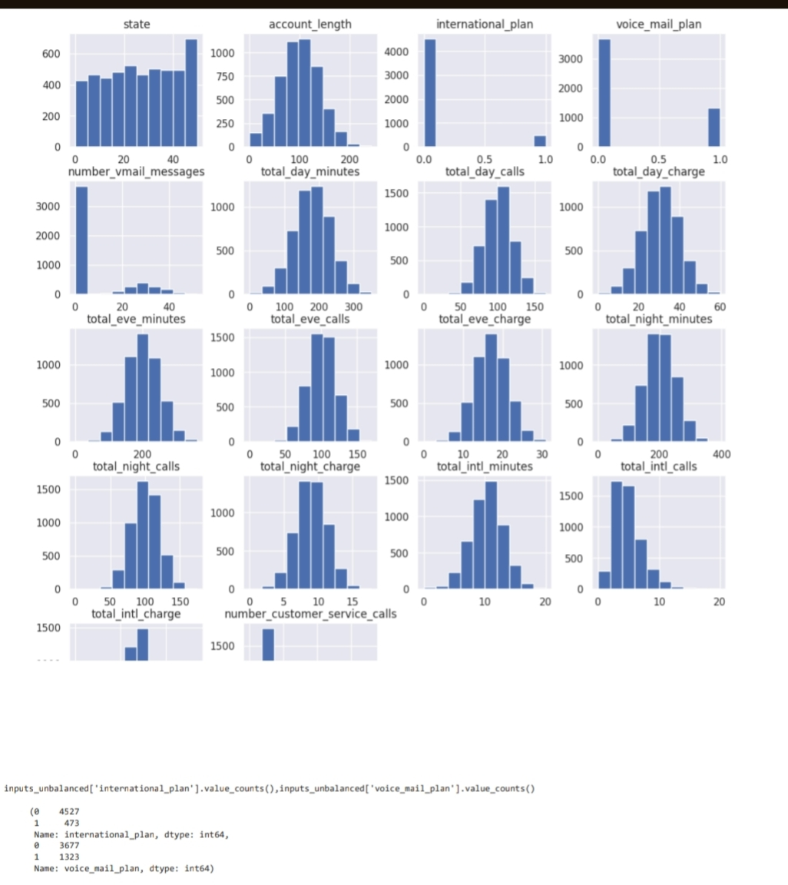
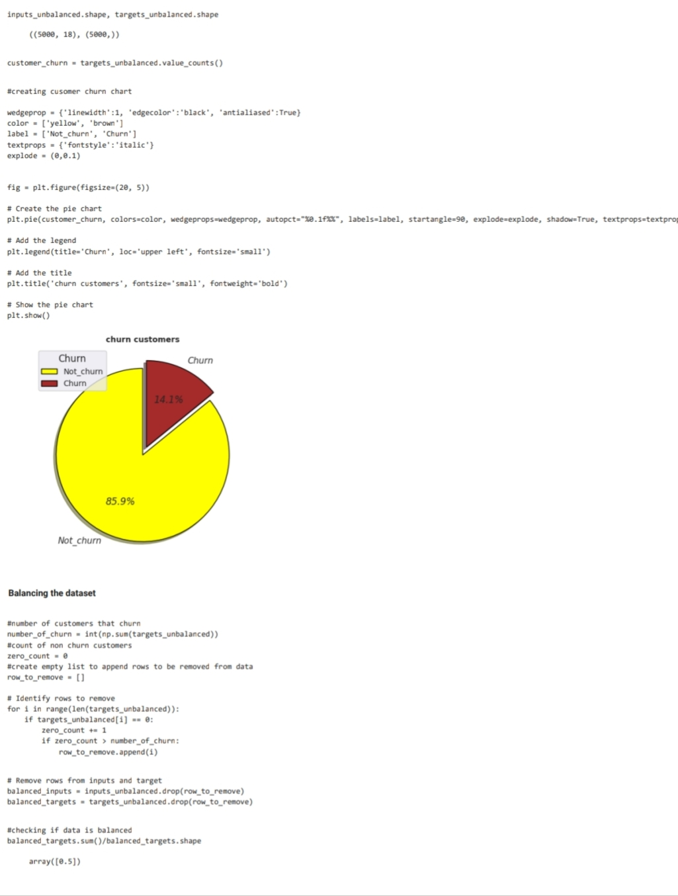
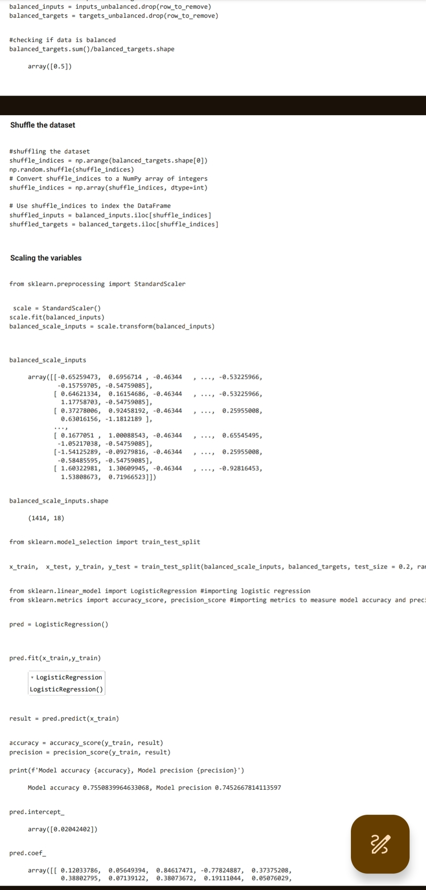
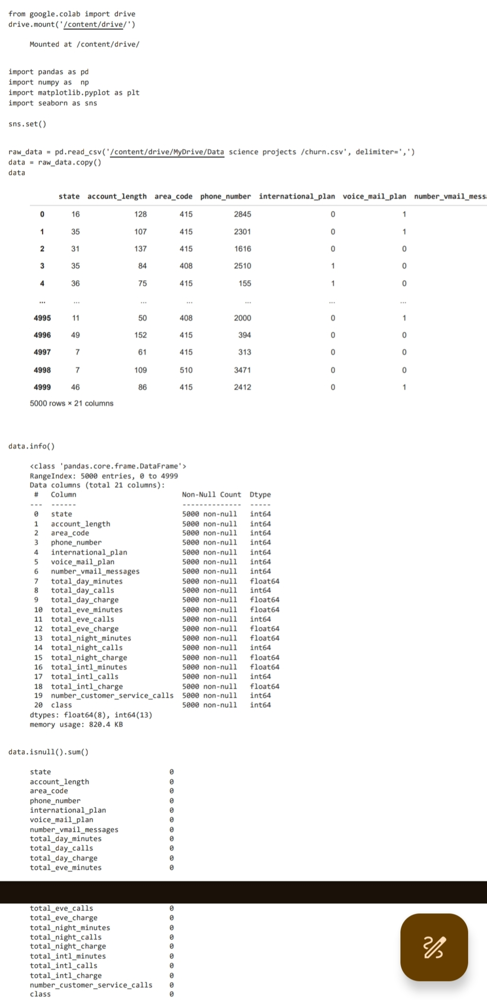
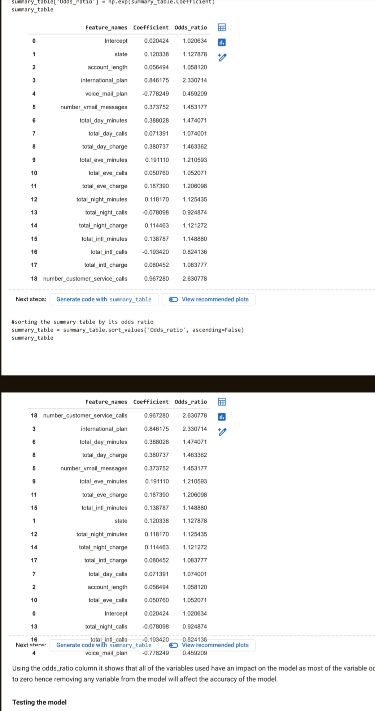
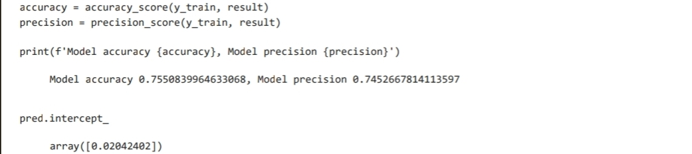

# customer-churn-preduction- 
### Project Description 
The "Customer Churn Prediction" project is a machine learning project aimed at predicting the probability of customer churn. Leveraging Python programming, Jupyter Notebook, and various libraries including pandas, numpy, matplotlib, seaborn, and scikit-learn, this project showcases proficiency in predictive analysis, critical thinking, data manipulation, preprocessing, machine learning, and exploratory data analysis (EDA).
The project utilized a dataset named "churn" containing features such as state, area code, account length, international plan, phone number, voice mail plan, number of voicemail messages, and various call and charge metrics. Through comprehensive data preprocessing and exploratory data analysis, insights were gained into the characteristics of churned customers.

Using logistic regression as the predictive modeling technique, a machine learning model was trained to predict the probability of customer churn. The model achieved a respectable accuracy of 78%, indicating its effectiveness in identifying potential churners. 
### Skills Utilized 
Predictive Analysis 
Critical Thinking 
Data Manipulation 
Data Preprocessing 
Machine Learning 
Exploratory Data Analysis (EDA) 
Python Programming 
Jupyter Notebook 
Pandas 
Numpy 
Matplotlib 
Seaborn 
Scikit-learn 
### Key Features 
Utilizes logistic regression to predict the probability of customer churn.
Displays the probability of customer churning.
Provides feature importance analysis of the variables. 
### Project Images 
#### Charts

#### Code snippet 

.
#### feature importance 

#### result obtained 

### Result Obtained 
After training the model, the project achieved an accuracy of 75% on the test dataset. 
 

# How to improve the model accuracy 
You can try to improve the model accuracy by not scaling the variables in the dataset also you can improve accuracy by not reducing the dataset as i did in thie project. 
Feel free to customize the content and formatting as needed for your
GitHub readme documentation. Let me know if you need further assistance!
